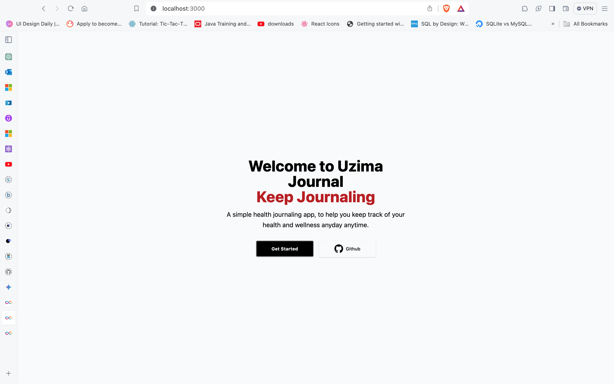
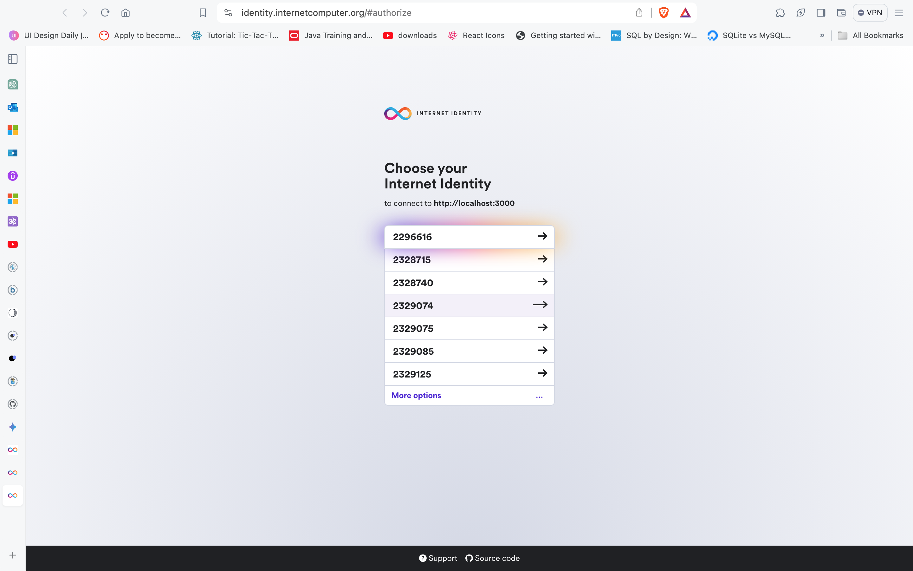
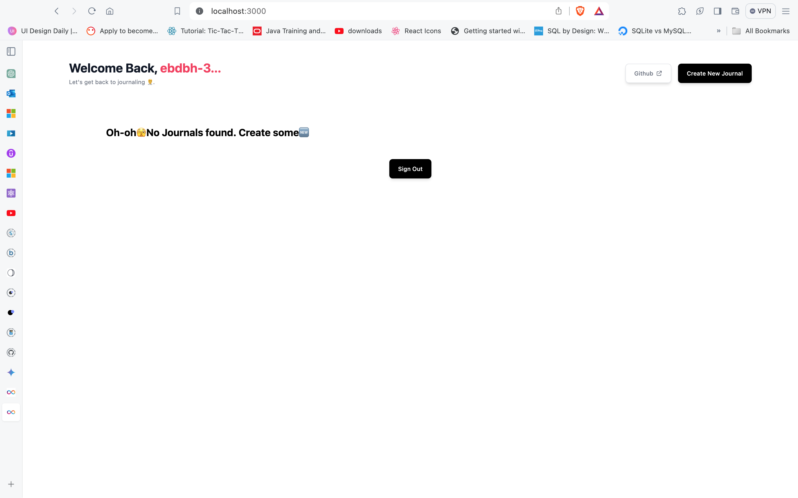
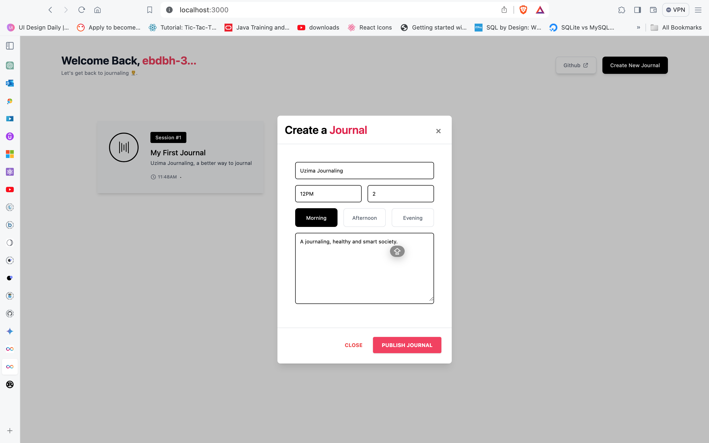
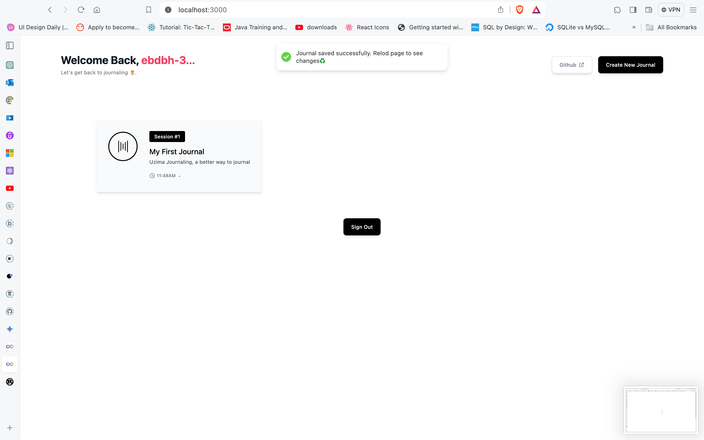
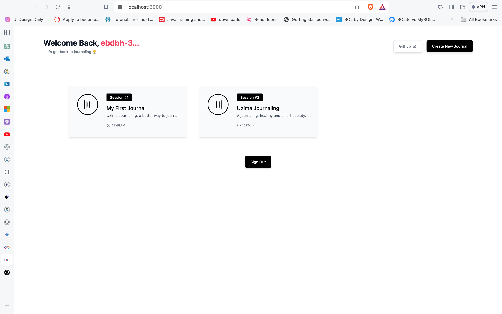

# UZIMA JOURNAL GITDOCS


- [Uzima Journal](#uzima-journal)
  - [Features](#features)
  - [Benefits of Using Uzima Journal](#benefits-of-using-uzima-journal)
  - [Getting Started](#getting-started)
    - [Prerequisites](#prerequisites)
    - [Setting up dev environment](#setting-up-dev-environment)
    - [Interacting with Uzima Journal](#interacting-with-uzima-journal)
  - [Technology Stack](#technology-stack)
  - [Documentation](#documentation)
  - [License](#license)
  - [Contact](#contact)

# Uzima Journal

Uzima Journal is a health journaling app that allows users to track and record their daily health progress. The app is designed to help users maintain a comprehensive record of their health and well-being, which can be useful in various scenarios, including visits to healthcare professionals. The app is built using `React(Typescript)` and `Azle`- also a Typescript SDK for building on the internet computer.

## Features

- **Daily Journaling**: Users can create entries to record their health status, symptoms, medications, exercise routines, and any other relevant information.
- **Track Progress**: The app provides tools to track progress over time, allowing users to visualize trends and patterns in their health.

## Benefits of Using Uzima Journal

- **Improved Communication with Healthcare Professionals**: Having a detailed health journal can help users effectively communicate their symptoms, experiences, and concerns to healthcare professionals, enabling them to receive more accurate diagnoses and personalized treatment plans.
- **Identifying Patterns and Triggers**: By regularly journaling their health, users can identify patterns and triggers that may affect their well-being. This can help them make informed decisions about their lifestyle, diet, and medication.
- **Monitoring Progress**: Uzima Journal allows users to track their progress over time, enabling them to see improvements or identify areas that need attention. This can be motivating and empowering for users on their health journey.
- **Enhanced Self-Awareness**: Journaling can promote self-reflection and self-awareness, helping users gain a deeper understanding of their health and well-being. This can lead to better self-care practices and overall improved quality of life.

## Getting Started

### Prerequisites

To interact with Uzima Journal locally ensure you have the following installed:

1. NodeJs: `<https://nodejs.org/en/download``>
2. DFX v0.15: `<https://internetcomputer.org/docs/current/references/cli-reference/dfx-parent``>
3. Rust: `https://www.rust-lang.org/tools/install`

### Setting up dev enviroment

After installations follow these steps to launch Uzima Dao:

1. Fork the repository: `git clone https://github.com/divin3circle/uzima-journal.git`
2. After forking the repository, clone your version of the repository to your local enviroment
3. Open the repository in VS Code and run the follwowing command:

```sh
dfx start --clean --background # Run dfx in the background
```

4. Then run these commands in your VS Code terminal:

```sh
npm run setup # Install packages, deploy canisters, and generate type bindings
npm start # Start the development server
```

`npm run setup` installs all the dependecies of Uzima Journal, deploys the frontend and backend canister to the testnet and generate the type bindings
which facilitates frontend and backend interactions.
`npm start`spins up the React development server

### Interacting with Uzima Journal

1. Open your localhost via: `localhost:3000`. Click getstarted to be authenticated with your internet identity.
   

1. Use you internet identity or create a new one:
   

1. After your account has been created you will be logged in to the homepage. From here you can click on the rose-red text besids the `Welcome back` heading
   on the to right. an alert will pop up showing your principal:
   

1. To create a new journal, click on the `create new journal` button on the top left:
   

1. Then hit save, an alert will promt you to refresh the page:
   

1. 

You can also interact with the backedn canister alone using Candid UI. To do this, stop the Vite dev sever using `CTRL + c` or `CMD + C` on mac. Then stop the dfx sever as well by running `dfx stop'. Repeat process number four on [Setting up dev environment](#setting-up-dev-enviroment).
Then the command below nad open the candid ui link in your browser.

```sh
dfx deploy backend
```


## Technology Stack

- [Vite](https://vitejs.dev/): high-performance tooling for front-end web development
- [React](https://reactjs.org/): a component-based UI library
- [TypeScript](https://www.typescriptlang.org/): JavaScript extended with syntax for types
- [Sass](https://sass-lang.com/): an extended syntax for CSS stylesheets
- [Prettier](https://prettier.io/): code formatting for a wide range of supported languages
- [Azle](https://github.com/demergent-labs/azle): a TypeScript CDK for the Internet Computer

## Documentation

- [Vite developer docs](https://vitejs.dev/guide/)
- [React quick start guide](https://beta.reactjs.org/learn)
- [Internet Computer docs](https://internetcomputer.org/docs/current/developer-docs/ic-overview)
- [Azle Book](https://demergent-labs.github.io/azle/)
- [`dfx.json` reference schema](https://internetcomputer.org/docs/current/references/dfx-json-reference/)

## License

This project is licensed under the [MIT License](LICENSE).

## Contact

If you have any questions or suggestions, feel free to reach out at [sylusabel1@gmail.com](mailto:sylusabel1@gmail.com).
